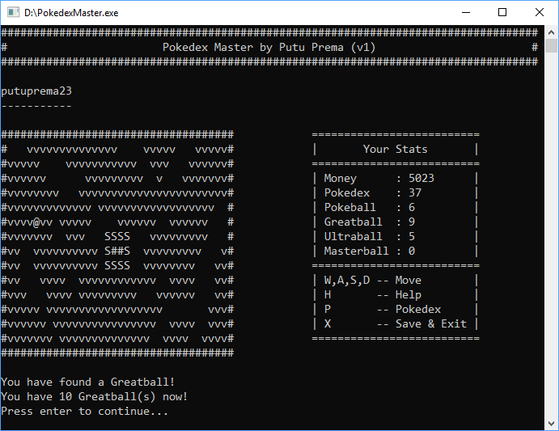

# Pokedex Master
Pokedex Master is a simulation for a pokemon master who wants to conquer all legendary pokemons. 

## Features
1. Customizable map (by editing "map.txt" file).
2. Customizable pokedex (by editing "pokedex.txt" file).
3. Save/load player progress.
4. Meet a random pokemon and use one of the four balls (Pokeballs, Greatballs, Ultraballs, Masterballs) to catch them.
5. PokeShop: Sell and Buy Pokeballs, and Pokemon Trading.
## How To Play
1. To move use key [ w | a | s | d ].
2. To open your pokedex use key [p].
3. To exit and save the game use key [x].
4. grass [v] is where you can find pokemon, item, or money.
5. shop [s] is where you can open shop menu to sell or buy item.
## Download
You can download the game [here](https://github.com/putuprema/pokedex-master/releases).
## Or build your own!
The game is made with C language. You can compile the source code using your favorite IDE (I used Dev-C++ to make the game).
